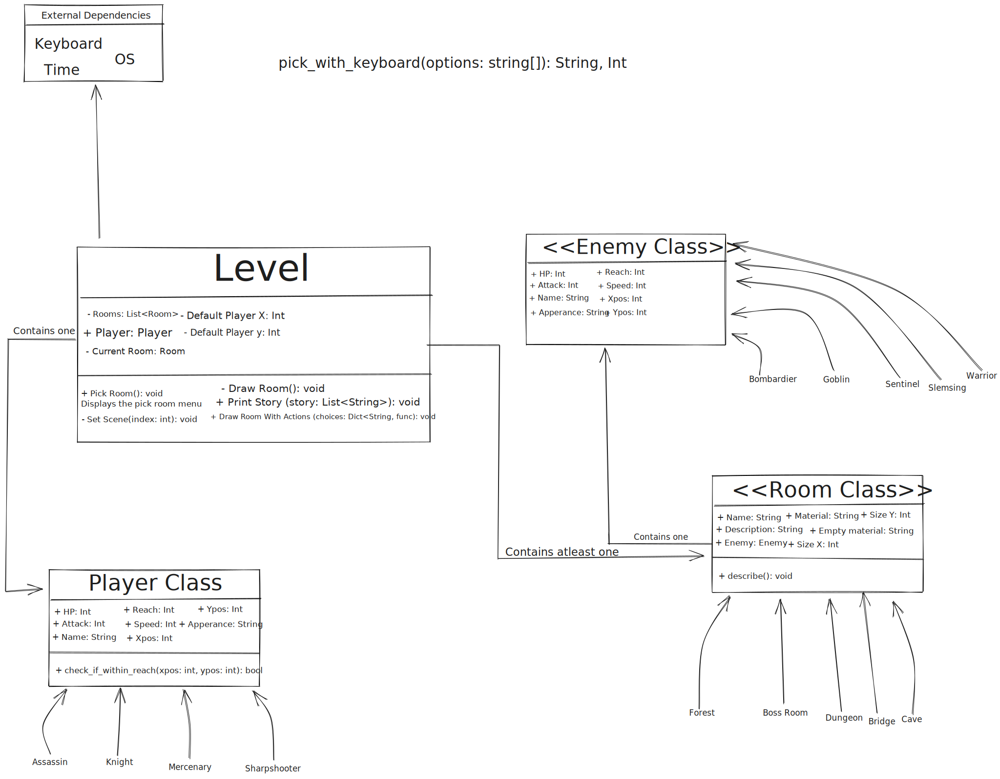

# Crafting the README.md content

readme_content = """
# IT2EventyrSpill

A Python-based adventure game project, organized with various modules and classes for gameplay elements.

## Table of Contents
- [Description](#description)
- [Installation](#installation)
  - [Prerequisites](#prerequisites)
  - [Installation Steps](#installation-steps)
- [Usage](#usage)
- [License](#license)
- [Credits](#credits)
- [UML Diagram](#uml-diagram)
- [Changelog](#changelog)

## Description
The project is organized into different modules and directories, each focusing on different aspects of the game such as combat mechanics, character classes, and game levels. Dive into the respective directories and files to explore more.

## Installation

### Prerequisites
- Python 3.x
- Required libraries and dependencies (refer to `requirments.txt`)

### Installation Steps
1. Clone the repository.
2. Navigate to the project directory.
3. Install the required libraries using the command: `pip install -r requirments.txt`
4. Run `main.py` to start the game.

Usage

## Usage
To play the game, simply run the `main.py` script. Use the in-game prompts and instructions to navigate through the game's narrative and combat scenarios.

## License
[Insert License Details Here]

## Credits
- Libraries and tools used are listed in `requirments.txt`.
- Game assets can be found in the `Assets` directory.

## UML Diagram

Changelog

## Changelog
- Initial release. Further updates will be documented here.

"""

readme_content
